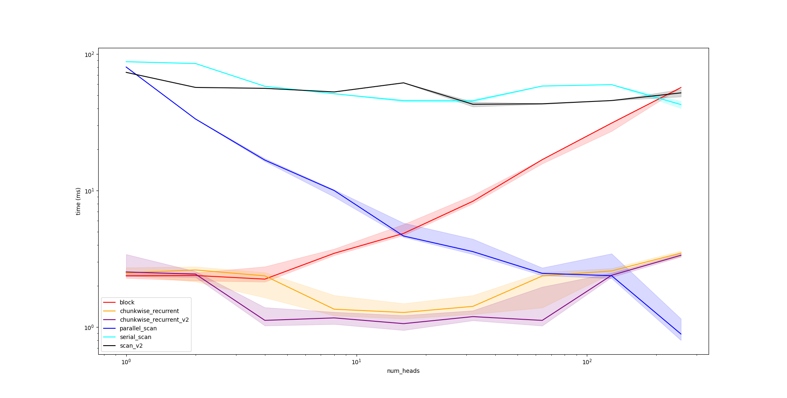

<script>
window.MathJax = {
    tex: {
      tags: 'ams',
      inlineMath: [['$', '$'], ['\\(', '\\)']]
    }
};
</script>

[Retention networks](https://arxiv.org/abs/2307.08621) have been making waves in the large language model scene, with big claims about the potential to replace transformers with training parallelism, cheaper inference and good performance. I noticed some similarities with other work on [RWKV](./2023-10-01-improving-rwkv.md) and [fast attention](./2022-11-30-simple-fast-attention.md) and wanted to see if any of the ideas were transferable.

## TL;DR

- I implemented retention networks using [keras-nlp](https://keras.io/keras_nlp/). There aren't any publicly available weights so it's not much use for the moment, but feel free to check out the [repo](https://github.com/jackd/keras-retnet);
- As well as the original implementations, I explored some other implementations based on parallel associative scans that slightly improve performance; and
- I explore the scaling behaviour of various implementations and motivate an alternative model architecture.

## Retnet: A Review

The main contribution of retention networks is to replace the attention module from transformers with so-called _retention_,

$
\text{Retention}(Q, K, V) = \left(D \odot K Q^T\right) V,
$

where $\odot$ represents an elementwise product and $D$ is a lower-triangular matrix with values given by powers of a scalar $0 < \gamma < 1$,

$
D_{ij} =\begin{cases}
      \gamma^{i-j} & i \ge j \\
      0            & \text{otherwise}
   \end{cases}.
$

wher $Q \in \mathbb{R}^{T \times d_k}$, $K \in \mathbb{R}^{T \times d_k}$ and $V \in \mathbb{R}^{T \times d_v}$ are key, query and value tensors with obvious analogies in standard attention, $T$ is the sequence length and $d_k$ and $d_v$ are the key and value dimension respectively. The authors also propose multi-scale retention analogous to multi-head attention where decay values $\gamma$ vary across heads.

In terms of implementation, the authors propose 3: a highly parallelizable block implementation for training, a serial recurrent implementation for cheap/low latency inference and a hybrid chunkwise recurrent implementation that attempts to combine some of the parallelism offered by the block implementation with the scalability of the recurrent implementation. Let's explore each of them in more detail.

### Block Implementation

The block implementation is simplest and involves straight forward evaluation of the definition, i.e. the product $KQ^T$, it's element-wise product with an explicitly evaluated $D$ and then multiplication by values $V$. Critically, this involves only highly optimized matrix-matrix multiplications and a trivially parallelizable elementwise product, making this ideal for application on accelerators like GPUs or TPUs.

The main downside of this method is that explicitly forming $KQ^T$ requires $\mathcal{O}(T^2 d_k)$ time and $\mathcal{O}(T^2)$ space - the same complexities as attention. This is fine for short sequences, but is a limiting factor for scaling to long context windows.

### Recurrent Implementation

The recurrent implementation computes outputs sequentially, using

$
S_{n} = \gamma S_{n-1} + K_n^T V_n,
$

$
\text{Retention}(Q, K, V)_n = Q_n S_n.
$

This removes the quadratic dependency on sequence length at the cost of parallelism, as the recurrence relationship must be iterate for each token sequentially.

### Chunkwise Recurrent Implementation

The chunkwise recurrent implementation attempts to find a middle ground between the block and recurrent implementations by breaking sequences into fixed sized chunks. See the original paper for the exact equations, but the key ideas can be summarised as:

- use the block implementation for each chunk independently to compute _intra-chunk_ retention;
- compute the total retention contribution of each chunk to each subsequent chunk. Critically, this is an accumulation over all tokens in each chunk, so we only have one accumulation for each chunk, rather than one contribution per token; and
- accumulate chunk contributions across chunks and add a lagged version to the intra-chunk retention.

A jax implementation is given below. Note it is a simplified version of the [official implementation](https://github.com/microsoft/torchscale/blob/main/torchscale/component/multiscale_retention.py#L114) (though with appropriate `vmap`ing to add head and batch dimensions gives the same results to within numerical error).

```python
def retention_chunkwise_recurrent(
    query: jnp.ndarray,
    keys: jnp.ndarray,
    values: jnp.ndarray,
    gamma: jnp.ndarray,
    *,
    chunk_size: int = 64,
) -> jnp.ndarray:
    """
    Compute retention using chunkwise recurrent method.

    Args:
        query: [T, d_k]
        keys: [T, d_k]
        values: [T, d_v]
        gamma: [] (scalar)
        chunk_size: size of each chunk. Must be a factor of `T`.
        parallel: whether to execute the cross-chunk accumulation
            using a serial or parallel scan.
    
    Returns:
        [T, d_v]
    """
    query = jnp.reshape(query, (num_chunks, chunk_size, d_k))
    keys = jnp.reshape(keys, (num_chunks, chunk_size, d_k))
    values = jnp.reshape(values, (num_chunks, chunk_size, d_v))

    # compute per-chunk accumulated KV values
    # note this is a reduction over the chunk size `s`
    # also note there's no need to include the final chunk
    kv = jnp.einsum(
        "csk,s,csv->ckv",
        keys[:-1],
        gamma ** jnp.arange(chunk_size, 0, -1),
        values[:-1],
    )

    # accumulate reduced chunk contributions across chunks
    # see "Reformulation with Parallel Associative Scan" section below
    kv = cumulative_ema(
        kv, jnp.full((num_chunks - 1, 1, 1), gamma**chunk_size)
    )
    # pad to align prior-chunk contributions with original chunk indices
    kv = jnp.pad(kv, ((1, 0), (0, 0), (0, 0)))

    # reduce over key dimension `k` while re-introducing intra-chunk index `s`
    # this means we never need to store [T, d_k, d_v] elements ever
    # making it more space-efficient than the parallel recurrent implementation
    inner_decay = gamma ** jnp.arange(chunk_size)
    cross_output = jnp.einsum("csk,s,ckv->csv", query, inner_decay, kv)
    # compute per-chunk intra-chunk retention using block implementation.
    inner_output = jax.vmap(
        functools.partial(retention_block, gamma=gamma, rescale=False)
    )(query, keys, values)
    # add intra-chunk retention and inter-chunk retention
    output = inner_output + cross_output
    # merge chunk indices back to single sequence length T
    return jnp.reshape(output, (T, d_v))
```

## Reformulation with Parallel Associative Scan

We said above that the recurrent implementation suffered from lack of parallelism due to its inherently sequential nature. This doesn't have to be the case, however. It turns out that the exponential moving average being computed can be represented as a cumulative sum using a special operator $\oplus$ that operates on $\left\{x, \gamma \right\}$ tuples,

$
\left\{x_a, \gamma_a \right\} \oplus \left\{x_b, \gamma_b \right\} = \left\{\gamma_b x_a + x_b, \gamma_a \gamma_b \right\}.
$

While it's not commutative like most "plus" operators, it is associative, which means its usable in _associative scan_ implementations. This is the thread that ties this to previous ideas I've played with in both fast attention and RWKV. A full overview of associative scan algorithms is beyond the scope of this post, but it should be enough to know that it is a well-studied problem in computer science and that efficient, parallelizable implementations exist. In particular, `jax` has `jax.lax.associative_scan`, making a cumulative exponential moving average function trivial to implement:

```python
import jax.numpy as jnp

def cumulative_ema_op(a, b):
    xa, fa = a
    xb, fb = b
    return xa * fb + xb, fa * fb

def cumulative_ema(
    values: jnp.ndarray,
    factors: jnp.ndarray,
    reverse: bool = False,
    axis: int = 0,
) -> jnp.ndarray:
    assert values.shape == factors.shape
    f, t = jax.lax.associative_scan(
        cumulative_ema_op, (values, factors), reverse=reverse, axis=axis
    )
    return f
```

We can thus implement retention

```python
def retention_scan(
    query: jnp.ndarray,
    keys: jnp.ndarray,
    values: jnp.ndarray,
    gamma: jnp.ndarray,
) -> jnp.ndarray:
    """
    Args:
        query: [T, d_k]
        keys: [T, d_k]
        values: [T, d_v]
        gamma: [] (scalar)

    Returns:
        [T, d_v]
    """
    KV = jnp.expand_dims(keys, -1) * jnp.expand_dims(values, -2)  # [T, d_k, d_v]
    gamma = jnp.full((query.shape[0], 1, 1), gamma)
    acc = cumulative_ema(KV, gamma)  # [T, d_k, d_v]
    return jnp.einsum("tk,tkv->tv", query, acc)
```

So if this adds parallelism to the recurrent implementation, and the recurrent implementation's only weakness was its lack of parallelism, does this mean we've found the perfect implementation? A strict upgrade over the chunkwise recurrent version? You'd be forgiven for thinking so. At first I thought the chunkwise recurrent implementation was just a sub-optimal associative scan.

Unfortunately, that's not the case. This implementation suffers from a major weakness in that it requires the computation and storage of $\mathcal{O}(T d_k d_v)$ (`KV` and `acc` in the above code). This is less of a problem in the chunkwise recurrent implementation, because reduction over chunk size occurs at the same time as the $d_v$ dimension is introduced, and the chunk size dimension is only re-introduced during a reduction over $d_k$. See comments in the chunkwise recurrent implementation for the specific lines where this happens.

## Scaling: Are More Heads Better?

Throughout this post we've been discussing vanilla retention implementations. Extension to the multi-head environment is trivial in jax thanks for `jax.vmap`:

```python
def multi_head_retention(query, keys, values, gamma, retention_impl):
    """
    Args:
        query: [T, H, d_k]
        keys: [T, H, d_k]
        values: [T, H, d_v]
        gamma: [T]
    
    Returns:
        [T, H, d_v]
    """
    return jax.vmap(
        retention_impl, in_axes=(1, 1, 1, 0), out_axes=1
    )(query, keys, values, gamma)
```

What's much more interesting than the implementation however is the scaling of our implementations. Consider an experiment where the total number of channels across all heads is fixed to $D_k$ and $D_v$ for keys/queries and values respectively. With $H$ heads, this leaves $d_k = D_k / H$ and $d_v = D_v / H$. Our block implementations now requires $\mathcal{O}(HT^2 d_k) = \mathcal{O}(T^2 D_k)$ time and $\mathcal{O}(HT^2)$ space. Our fully parallel scan implementation however requires $\mathcal{O}(H T d_k d_v) = \mathcal{O}(T D_k D_v / H)$ time and space. Critically, the block implementation requires space proportional to the number of heads, while our parallel scan implementation takes space _inversely_ proportional. Since memory access is a major contributor to runtimes on accelerators in practice, we would expect these scalings to loosely hold for inference speed as well as memory requirements.

## Benchmark Results

So how do all these implementations go? Below is a plot of a single retention inference speed on a sequence of 2048 tokens. We fix the total number of channels across all heads to 512 and vary the number of heads from 1 to 256 in powers of 2 along the x-axis.



We note the following behaviour:

- the serial scan implementations (cyan, black) are uniformly terrible;
- the chunkwise recurrent implementatioins are good across the board, with our implementation using a parallel scan for chunk accumulation (v2) performing slightly better;
- the block implementation is fast for a small number of heads, but gets worse with increasing numbers of heads; and
- our parallel scan implementation has the opposite behaviour, performing poorly when there are a small number of heads but out-performing all other implementations when the number of heads approaches the total number of channels.

In practice, it's worth noting the hyperparameter sets proposed in the original paper uses a fixed $d_k=256$, with larger models using a larger number of heads. This corresponds to number of heads of 2 in the above plot - way over on the left side - where the block and chunkwise implementations all perform roughly equivalently and significantly out-perform the parallel scan implementation. This does prompt the question: what would happen if we drastically increased the number of heads? Say, to the point where each head only had a single channel? Training using a block implementation would be infeasible, but the parallel scan implementation starts to become a lot more attractive. What other architectural changes would be neccessary to make such a network trainable?

For answers to these questions and more... stay tuned! And if you've got access to compute resources and want to collaborate, please get in touch! Answering some of the questions posed in these articles can only be done with significant computation, and there's only so much I can do on my laptop GPU can take!
